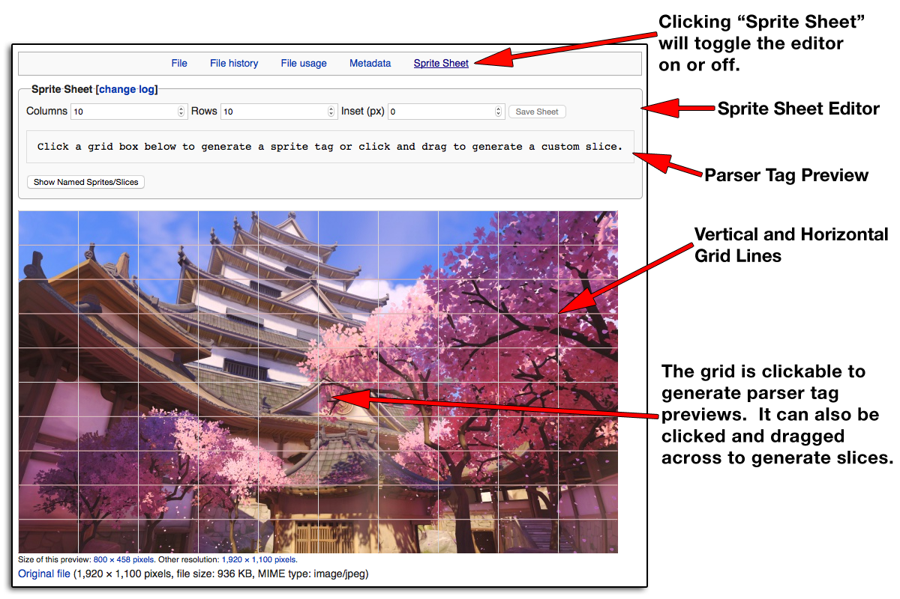
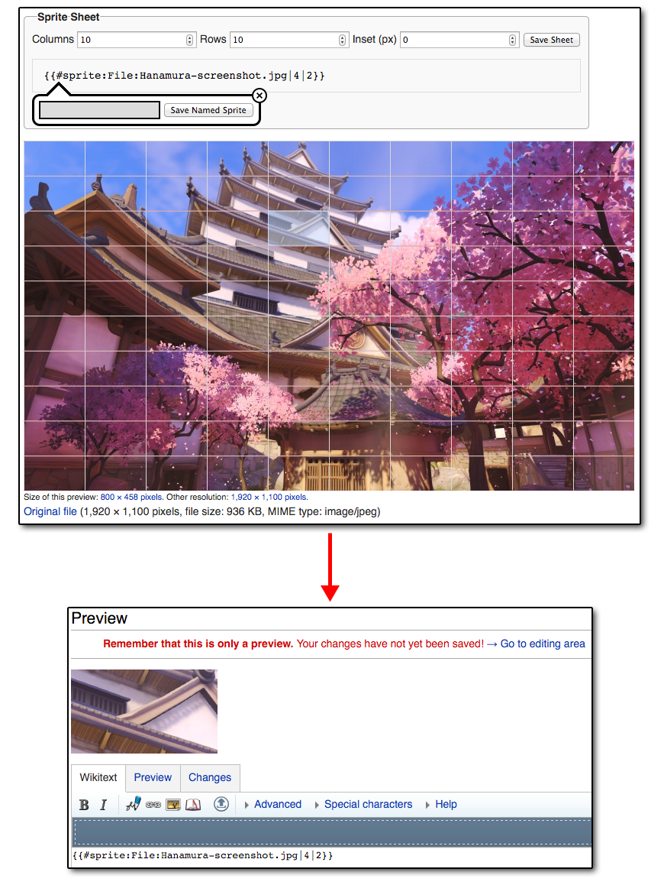
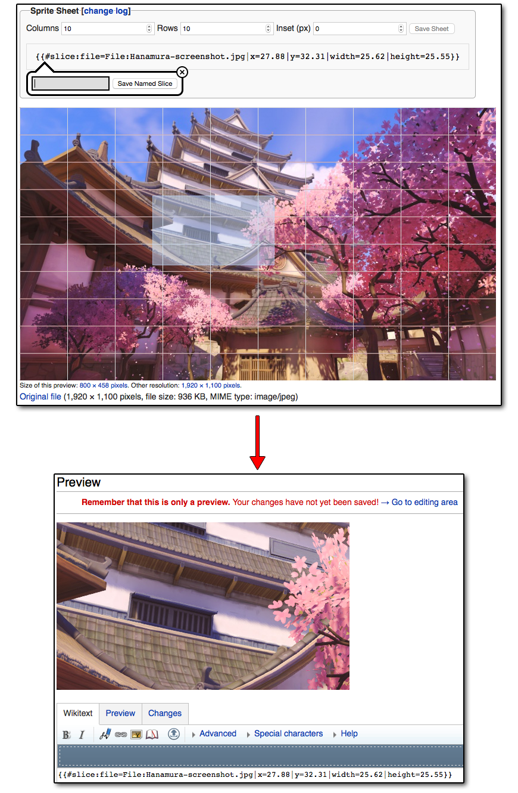
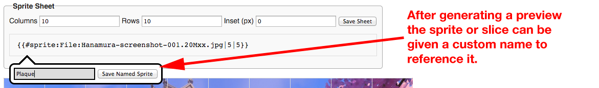

The **SpriteSheet** extension allows uploaded images to be divided into sprite sheets or custom slices to be displayed without having to use an external image editor.  The resulting sprites and slices are dynamically generated using CSS.

* **Project Homepage:** [Documentation at Github](https://github.com/CurseStaff/SpriteSheet)
* **Mediawiki Extension Page:** [Extension:SpriteSheet](https://www.mediawiki.org/wiki/Extension:SpriteSheet)
* **Source Code:** [Source Code at Github](https://github.com/CurseStaff/SpriteSheet)
* **Bugs:** [Issue Tracker at Github](https://github.com/CurseStaff/SpriteSheet/issues)
* **Licensing:** SpriteSheet is released under [The GNU Lesser General Public License, version 3.0](http://opensource.org/licenses/lgpl-3.0.html).

#Installation

Download and place the file(s) in a directory called EmbedVideo in your extensions/ folder.

Add the following code at the bottom of your LocalSettings.php:

	require_once("$IP/extensions/EmbedVideo/EmbedVideo.php");

Done! Navigate to "Special:Version" on your wiki to verify that the extension is successfully installed.

#Usage

##Tags

###\#sprite - Parser Tag
Basic Syntax:

	{{#sprite:File:Image_Name.png|xPos|yPos}}

With optional thumbnail resize:

	{{#sprite:File:Image_Name.png|xPos|yPos|thumbWidth}}

####Attributes for #sprite Tag

|       Attribute       | Description                                                                                                                                                                         |
|----------------------:|-------------------------------------------------------------------------------------------------------------------------------------------------------------------------------------|
| File                  | **Required**: yes The file page containing the image to use.                                                                                                                    |
| X Coordinate Position | **Required**: yes The X Coordinate Position of the sprite to select.  Coordinates use zero based numbering.                                                                     |
| Y Coordinate Position | **Required**: yes The Y Coordinate Position of the sprite to select.  Coordinates use zero based numbering.                                                                     |
| Thumb Width           | **Required**: no, **Default**: null Size the thumbnail width of the entire image before selecting,the sprite.  This is the width of the entire image; not the individual sprite.|

####Example

To display the sprite located at column 4, row 2:
<pre>{{#sprite:File:Hanamura-screenshot.jpg|4|2}}</pre>

###\#ifsprite - Parser Tag
The #ifsprite tag is used to call into a named sprite.  If the named sprite does not actually exist yet it will instead return the given wiki text fully parsed.

Basic Syntax:

	{{#ifsprite:File:Image_Name.png|spriteName|[thumbWidth]|[wikiText]}}

####Attributes for #ifsprite Tag

|       Attribute       | Description                                                                                                                                                                         |
|----------------------:|-------------------------------------------------------------------------------------------------------------------------------------------------------------------------------------|
| File                  | **Required**: yes The file page containing the image to use.                                                                                                                    |
| Sprite Name           | **Required**: yes The named sprite to load.                                                                                                                                     |
| Thumb Width           | **Required**: no, **Default**: null Size the thumbnail width of the entire image before selecting,the sprite.  This is the width of the entire image; not the individual sprite.|
| Wiki Text             | **Required**: no, **Default**: null The wiki text to parse and display if the named sprite is not found.  Can be left blank to not display anything.                            |

####Example

<pre>{{#ifsprite:File:Hanamura-screenshot.jpg|Plaque||[http://www.example.com/ Use This Example]}}</pre>

###\#slice - Parser Tag
Basic Syntax:

	{{#slice:File:Image_Name.png|xPercent|yPercent|widthPercent|heightPercent}}

With optional thumbnail resize:

	{{#slice:File:Image_Name.png|xPercent|yPercent|widthPercent|heightPercent|thumbWidth}}

####Attributes for #slice Tag

|       Attribute       | Description                                                                                                                                                                          |
|----------------------:|--------------------------------------------------------------------------------------------------------------------------------------------------------------------------------------|
| File                  | **Required**: yes The file page containing the image to use.                                                                                                                     |
| X Percentage Position | **Required**: yes The X Percentage Position of the slice to cut.                                                                                                                 |
| Y Percentage Position | **Required**: yes The Y Percentage Position of the slice to cut.                                                                                                                 |
| Width, in Percentage  | **Required**: yes Width in percentage starting from the Y position.                                                                                                              |
| Height, in Percentage | **Required**: yes Height in percentage starting from the Y position.                                                                                                             |
| Thumb Width           | **Required**: no, **Default**: none Size the thumbnail width of the entire image before selecting the sprite.  This is the width of the entire image; not the individual sprite. |

####Example

<pre>{{#slice:File:Hanamura-screenshot.jpg|28.25|32.97|25.12|23.58}}</pre>

###\#ifslice - Parser Tag
The #ifslice tag is used to call into a named slice.  If the named slice does not actually exist yet it will instead return the given wiki text fully parsed.

Basic Syntax:

	{{#ifslice:File:Image_Name.png|sliceName|[thumbWidth]|[wikiText]}}

####Attributes for #ifslice Tag

|       Attribute       | Description                                                                                                                                                                         |
|----------------------:|-------------------------------------------------------------------------------------------------------------------------------------------------------------------------------------|
| File                  | **Required**: yes The file page containing the image to use.                                                                                                                    |
| Slice Name            | **Required**: yes The named slice to load.                                                                                                                                      |
| Thumb Width           | **Required**: no, **Default**: null Size the thumbnail width of the entire image before selecting,the slice.  This is the width of the entire image; not the individual slice.  |
| Wiki Text             | **Required**: no, **Default**: null The wiki text to parse and display if the named slice is not found.  Can be left blank to not display anything.                             |

####Example

<pre>{{#ifslice:File:Hanamura-screenshot.jpg|Plaque||[http://www.example.com/ Use This Example]}}</pre>

##Naming Sprites/Slices

After a sprite or slice has been selected a pop up will open under the tag preview.  This allows a custom name to be set for the selection that can be recalled later.  It uses the same #sprite and #slice parser tags with only the name as the first argument after the file name.  Adding the optional thumb width is still supported.

<pre>{{#sprite:File:Hanamura-screenshot.jpg|Plaque}}</pre>
<pre>{{#sprite:File:Hanamura-screenshot.jpg|Plaque|800}}</pre>
<pre>{{#slice:File:Hanamura-screenshot.jpg|Plaque}}</pre>
<pre>{{#slice:File:Hanamura-screenshot.jpg|Plaque|500}}</pre>